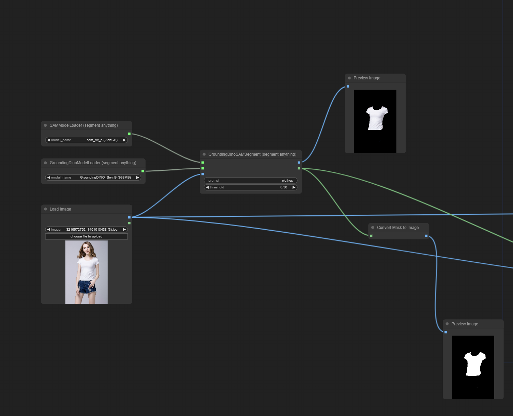
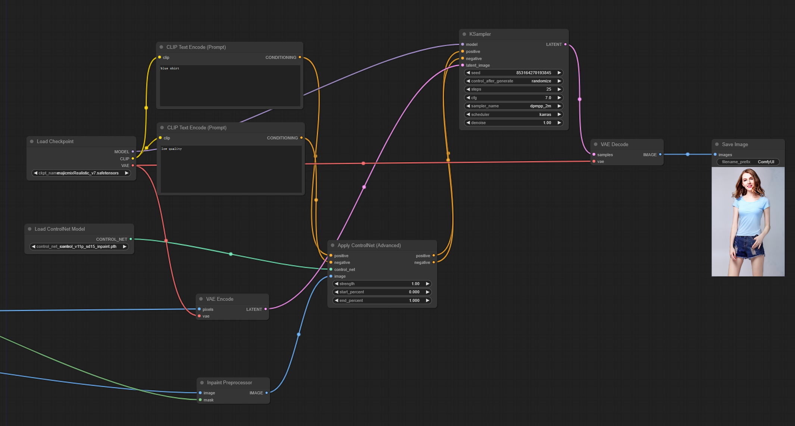
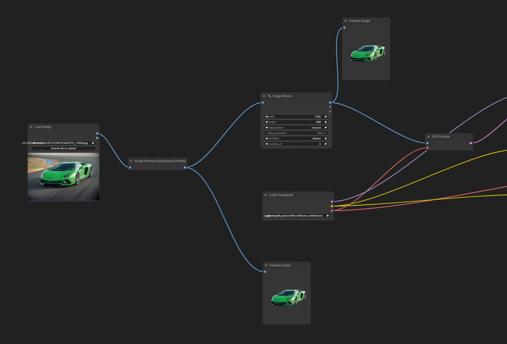

# Workflow-ComfyUI

## Segment Anything Model(SAM)
### [Sam.json](https://github.com/Spring0210/Workflow-ComfyUI/blob/main/Sam.json)

## 换装
### [change_clothes.json](https://github.com/Spring0210/Workflow-ComfyUI/blob/main/sam%2Bchange_clothes.json)
Sam + Inpaint

## 更换背景
### [remove+foreground2blending.json](https://github.com/Spring0210/Workflow-ComfyUI/blob/main/remove%2Bforeground2blending.json)
Remove Background + Layer Diffuse

### [generate_transparent_and_foreground2blending.json]
Generate transparent + Layer Diffuse

